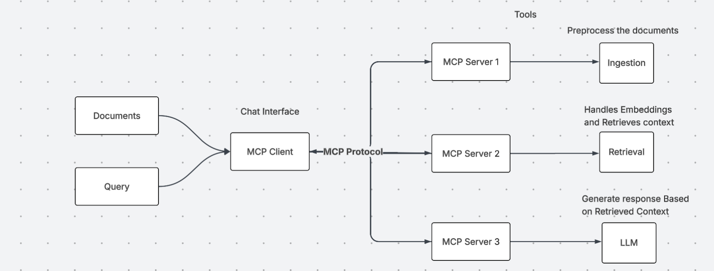

# **Agentic RAG Chatbot for Multi-Format Document QA**

A Streamlit-based Retrieval-Augmented Generation (RAG) chatbot built with an agentic architecture using Model Context Protocol (MCP). The system's core logic is driven by an LLM that decides when to use tools provided by specialized MCP servers to answer questions based on user-uploaded documents.

---

## 📦 Project Overview

This project is built on a client-server model where specialized agents act as tool providers.

*   **MCP Servers (The Tool Providers)**: These are independent Python scripts (`ingestion_agent.py`, `qa_agent.py`) that run as background processes. They expose their capabilities—like parsing a file or retrieving information—as callable tools.
*   **MCP Client (The Application Core)**: It connects to the MCP servers to access their tools.
*   **LLM (The Reasoning Engine)**: The Large Language Model (e.g., DeepSeek) is the "brain." The client presents it with a user's question and a list of available tools. The LLM then decides if it needs to call a tool to get more information before answering.
*   **Streamlit UI**: A web interface for uploading documents and chatting with your data.

---

## 🏛️ Architecture & Workflow

The workflow is designed around an LLM-driven tool-use paradigm, orchestrated by the MCP Client.



### **Step-by-Step Flow**

1.  **Document Processing (Building the Knowledge Base):**
    *   A user uploads documents via the **Streamlit UI**.
    *   The **MCP Client** accesses the `process_files` tool from the **Ingestion Agent Server**.
    *   The Client calls this tool to preprocess the documents into text chunks.
    *   The Client then uses the `build_index` tool from the **Retrieval Agent Server** to embed these chunks and create a searchable FAISS vector index.

2.  **Query Handling (Reasoning and Acting):**
    *   A user asks a question.
    *   The **MCP Client** presents this question to the **LLM**, making it aware of a `retrieve_context` tool available from the **Retrieval Agent Server**.
    *   The **LLM**, acting as the reasoning engine, determines it needs more information to answer and decides to call the `retrieve_context` tool.
    *   The **MCP Client** executes this tool call on behalf of the LLM, which makes the **Retrieval Agent Server** search its vector database for relevant information.
    *   The retrieved context is sent back to the **LLM**.
    *   Now equipped with the necessary information, the **LLM** generates the final, context-aware answer.

---

## ⚙️ Installation & Setup

1.  **Clone the repo**:

    ```bash
    git clone https://github.com/Makireddyvighnesh/Agentic-RAG-Chatbot-using-Model-Context-Protocol-MCP-.git
    cd Agentic-RAG-Chatbot-using-Model-Context-Protocol-MCP-
    ```

2.  **Create & activate venv**:

    ```bash
    python -m venv .venv
    source .venv/bin/activate     # macOS/Linux
    .\.venv\Scripts\activate  # Windows
    ```

3.  **Create `.env` file**: Create a file named `.env` and add your API key:
    ```
    DEEPSEEK_API_KEY="your_secret_api_key_here"
    ```

4.  **Install dependencies**:

    ```bash
    pip install -r requirements.txt
    ```

5.  **Start Streamlit**: The application handles starting the agents for you.

    ```bash
    streamlit run streamlit_app.py
    ```

