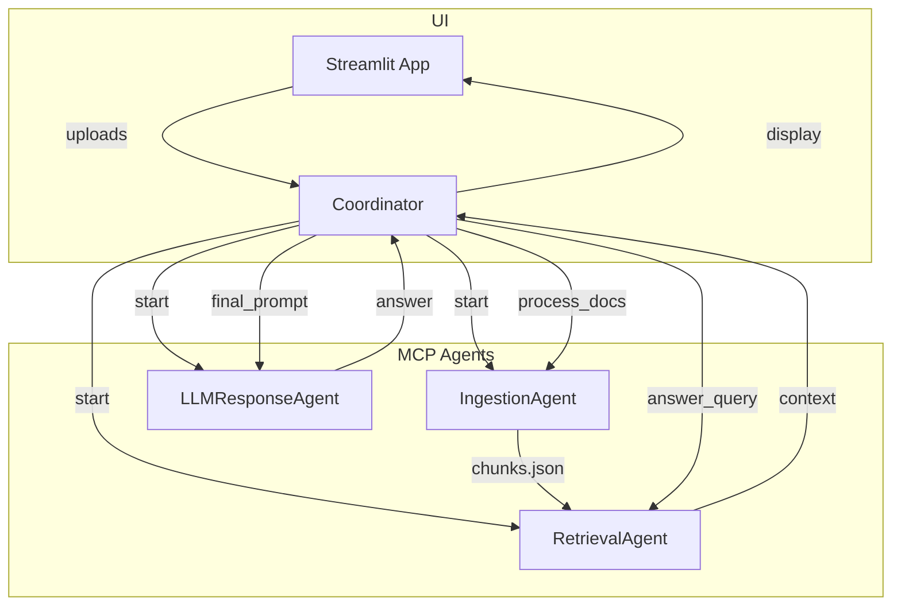

**Agentic RAG Chatbot for Multi‑Format Document QA**

A Streamlit‑based Retrieval‑Augmented Generation (RAG) chatbot built with an agentic architecture using Model Context Protocol (MCP). Users can upload documents (PDF, PPTX, DOCX, CSV, TXT), and the system parses, indexes, and answers questions based solely on their content.

---

## 📦 Project Overview

This project demonstrates how to build an extensible, agent‑based RAG system:

* **IngestionAgent**: Parses documents into text chunks and stores them.
* **RetrievalAgent**: Encodes chunks into embeddings and builds a FAISS index for semantic search.
* **LLMResponseAgent**: Composes prompts with retrieved context and generates answers via DeepSeek/OpenAI.
* **Coordinator** (`app.py`): Orchestrates agent startup, document processing, and multi‑step query handling (planning → retrieval → response).
* **Streamlit UI**: Provides a web interface for uploading documents and chatting with your data.

---

## 🏛️ Architecture & Workflow



1. **Startup**: Coordinator launches each agent (STDIO MCP).
2. **Ingestion**: User uploads files → IngestionAgent parses & chunks → saved to `chunks.json`.
3. **Indexing**: RetrievalAgent reads chunks, encodes embeddings, builds FAISS index.
4. **Query Handling**:

   * Coordinator sends user query to RetrievalAgent.
   * RetrievalAgent returns top‑k relevant chunks.
   * Coordinator forwards query + context to LLMResponseAgent.
   * LLMResponseAgent returns the final answer.
5. **Display**: Coordinator streams answer and source snippets back to Streamlit UI.

---

## ⚙️ Installation & Setup

1. **Clone the repo**:

   ```bash
   git clone https://github.com/Makireddyvighnesh/Agentic-RAG-Chatbot-for-Multi-Format-Document-QA-using-Model-Context-Protocol-MCP-.git
   cd Agentic-RAG-Chatbot
   ```

2. **Create & activate venv**:

   ```bash
   python -m venv .venv
   source .venv/bin/activate     # macOS/Linux
   .\.venv\Scripts\activate  # Windows
   ```

3. **Install dependencies**:

   ```bash
   pip install -r requirements.txt
   ```

4. **Run Agents** (in separate terminals):

   ```bash
   python ./server/ingestion_agent.py
   python ./server/retrieval_agent.py
   python ./server/llm_agent.py
   ```

5. **Start Streamlit**:

   ```bash
   streamlit run streamlit_app.py
   ```

